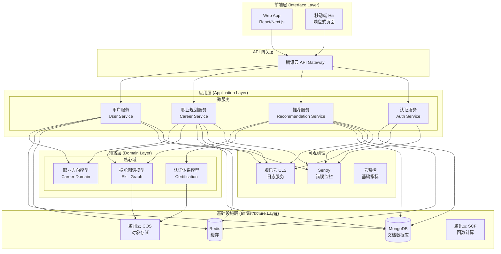
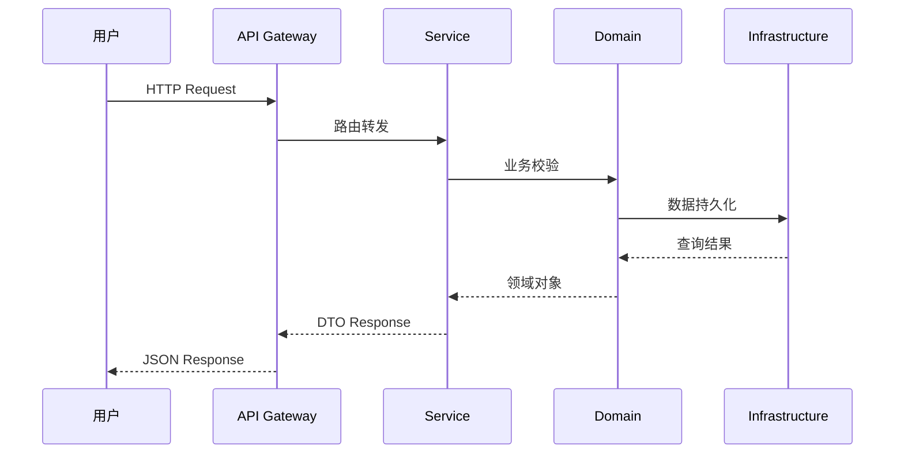
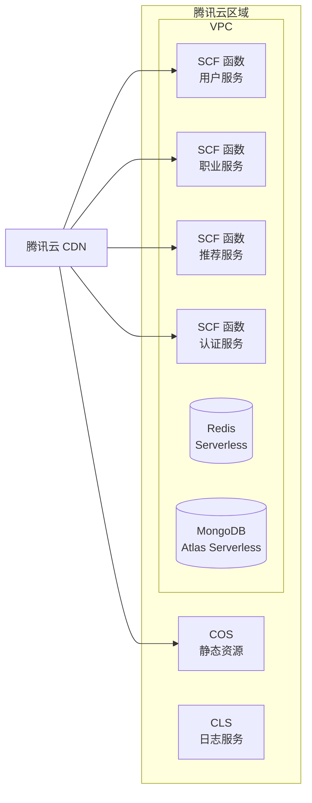

# 系统架构概览

## 1. 架构概览图



## 2. Clean Architecture 分层

```
┌─────────────────────────────────────────────────────────────┐
│                    Interface Layer (前端)                    │
│              Web App · 移动端 H5 · API Gateway                │
├─────────────────────────────────────────────────────────────┤
│                   Application Layer (应用)                    │
│         Use Cases · DTO · Service Interfaces                 │
├─────────────────────────────────────────────────────────────┤
│                     Domain Layer (领域)                       │
│          Entities · Value Objects · Domain Services          │
├─────────────────────────────────────────────────────────────┤
│                  Infrastructure Layer (基础设施)               │
│        MongoDB · Redis · COS · SCF · 第三方 API              │
└─────────────────────────────────────────────────────────────┘
```

## 3. 核心模块职责

| 模块 | 职责 | 技术选型 |
|------|------|----------|
| 用户服务 (US) | 用户注册/登录/认证 | JWT + 腾讯云 API Gateway |
| 职业规划服务 (CS) | 职业路径规划/技能树 | MongoDB + Redis |
| 推荐服务 (RS) | 个性化岗位/课程推荐 | MongoDB Graph 查询 |
| 认证服务 (AS) | 技能认证/证书管理 | COS + MongoDB |

## 4. 数据流架构



## 5. 部署架构 (MVP)



## 6. 质量属性目标

| 质量属性 | 目标值 | 策略 |
|----------|--------|------|
| 性能 | P99 < 500ms | Redis 缓存 · CDN 加速 |
| 可用性 | 99.9% | SCF 自动扩缩容 · 多可用区 |
| 安全性 | OAuth2 + JWT | HTTPS 强制 · 输入校验 |
| 可维护性 | 低耦合高内聚 | Clean Architecture · ADR |
| 可扩展性 | 水平扩展 | 无状态服务 · 函数计算 |
